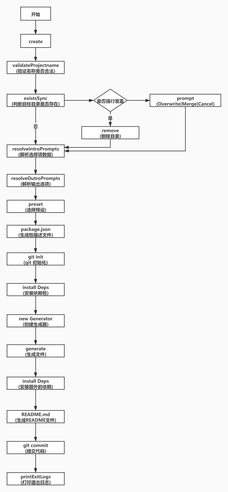

# 实现一个简易的vue-cli4脚手架

##  1.准备工作

项目实战中遇到的问题：维护多个仓库的公共代码是一件头疼的事情，每次对公共代码的改动都要全量仓库同步，最后决定用 monorepo 改造一番。

### 1.1 monorepo

- monoRepo： 是将所有的模块统一的放在一个主干分支之中管理。(指在一个项目仓库 (repo) 中管理多个模块/包 (package))
- multiRepo： 将项目分化成为多个模块，并针对每一个模块单独的开辟一个Repo来进行管理。

### 1.2 Lerna

> Lerna是一个管理多个 npm 模块的工具,优化维护多包的工作流，解决多个包互相依赖，且发布需要手动维护多个包的问题

### lerna vs yarn
两者很多功能是等价的
yarn用来处理依赖，lerna用于初始化和发布

### 1.3 必备模块

1. commander.js
commander 是一款强大的命令行框架，提供了用户命令行输入和参数解析功能

新建文件yx-cli-test/1.commander.js

```js
#!/usr/bin/env node
const program = require('commander');
program
    .version(`zhang-cli 0.0.0}`)   //指定版本号
    .usage('<command> [options]') //指定使用方式

program
    .command('create <app-name>') //添加一个命令 create <表示必填参数>
    .description('create a new project powered by vue-cli-service') //  vue-cli-service 相当于react-scripts  封装build serve
    .action((app-name) => {
        console.log(app-name);
    })

program.parse(process.argv)
```

可以通过 lerna add [内部还没发布的包] -scope=[安装到指定的包]

```bash
//在 yx-cli-test目录下，执行node 1.commander.js create hell1

hell1
```

2. Inquirer是一个交互式命令行工具

新建文件yx-cli-test/2.inquirer.js

```js
  resolveIntroPrompts () {
    const presets = this.getPresets()
    const presetChoices = Object.entries(presets).map(([name, preset]) => {
      let displayName = name
      if (name === 'default') {
        displayName = 'Default'
      } else if (name === '__default_vue_3__') {
        displayName = 'Default (Vue 3)'
      }
      
      return {
        name: `${displayName} (${formatFeatures(preset)})`,
        value: name
      }
    })
    const presetPrompt = {
      name: 'preset',
      type: 'list',
      message: `Please pick a preset:`,
      choices: [
        ...presetChoices,
        {
          name: 'Manually select features',
          value: '__manual__'
        }
      ]
    }
    const featurePrompt = {
      name: 'features',
      when: isManualMode,
      type: 'checkbox',
      message: 'Check the features needed for your project:',
      choices: [],
      pageSize: 10
    }
    return {
      presetPrompt,
      featurePrompt
    }
  }

```

```js
const inquirer = require('inquirer')
const isManualMode = answers => answers.preset === '__manual__';
let defaultPreset = {
    useConfigFiles: false,  //是否把babel eslint postcss 这些包对应的配置项是否放在单独的文件，false的话放在package.json里面
    cssPreprocessor: undefined, //默认没有配置css预处理器
    plugins: {
        '@vue/cli-plugin-babel': {}, //babel  官方提供的插件前缀是固定的 @vue/cli-plugin-
        '@vue/cli-plugin-eslint': { //eslint
            config: 'base', 
            lintOn: ['save'] //保存的时候进行lint检查
        }
    }
}
//预设
let presets = {
    'default': Object.assign({ vueVersion: '2' }, defaultPreset),
    '__default_vue_3__': Object.assign({ vueVersion: '3' }, defaultPreset)
}
const presetChoices = Object.entries(presets).map(([name, preset]) => {
    let displayName = name
    if (name === 'default') {
        displayName = 'Default'
    } else if (name === '__default_vue_3__') {
        displayName = 'Default (Vue 3)'
    }
    return {
        name: `${displayName}`,
        value: name
    }
})
//presetChoices = [{name:"Default",value:"default"},{name:"Default (Vue 3)",value:"__default_vue_3__"}]
const presetPrompt = {
    name: 'preset', //弹出的名称
    type: 'list', //如何选择
    message: `Please pick a preset:`,
    choices: [
        ...presetChoices,
        {
            name: 'Manually select features',
            value: '__manual__'
        }
    ]
}
let features = [
    'vueVersion',
    'babel',
    'typescript',
    'pwa',
    'router',
    'vuex',
    'cssPreprocessors',
    'linter',
    'unit',
    'e2e'
];
const featurePrompt = {
    name: 'features',  //手工选择的特性
    when: isManualMode, //如果when这个函数是true,就会弹出这个框，否则不弹出框
    type: 'checkbox', //复选框
    message: 'Check the features needed for your project:',
    choices: features, 
    pageSize: 10
}
const prompts = [
    presetPrompt, //如何选择预设
    featurePrompt //如何选择映射
]

;(async function(){
 let result = await inquirer.prompt(prompts);
 console.log(result);
})();

```
执行命令：node 2.inquirer.js


3. execa 
- execa 是可以调用 shell 和本地外部程序
- 它会启动子进程执行，是对child_process.exec的封装

```js
const execa = require('execa');

(async () => {
    const {stdout} = await execa('echo', ['hello']);
    console.log(stdout);
})();
```

yx-cli-test 下执行echo hello
```
hello
```

4. chalk
- chalk可以修改控制台字符串的样式，包括字体样式、颜色以及背景颜色等

```js
const chalk = require('chalk');
console.log(chalk.blue('Hello world!'));
```

5. isbinaryfile
- isbinaryfile可以检测一个文件是否是二进制文件

```js
const path = require('path');
const { isBinaryFileSync } = require('isbinaryfile');
let logo = path.join(__dirname,'template/assets/logo.png');
let isBinary = isBinaryFileSync(logo);
console.log(isBinary);
let main = path.join(__dirname,'template/main.js');
isBinary = isBinaryFileSync(main);
console.log(isBinary);

// true
// false
```

6. ora

yx-cli-test/6.ora.js

- ora主要用来实现node.js命令行环境的loading效果，和显示各种状态的图标等

```js
const ora = require('ora')
const spinner = ora()

exports.logWithSpinner = (msg) => {
    spinner.text = msg
    spinner.start();
}

exports.stopSpinner = () => {
    spinner.stop();
}

exports.logWithSpinner('npm install');
setTimeout(()=>{
    exports.stopSpinner();
},3000);
```
执行 node 6.ora.js可以看待loading效果

7. ejs

- ejs是高效的嵌入式 JavaScript 模板引擎
- slash将Windows反斜杠路径转换为斜杠路径，如foo\\bar➔ foo/bar
- globby是用于模式匹配目录文件的

#### 7.1 main.js
template/main.js

```js
<% if (rootOptions.vueVersion === '3') { %>
    import { createApp } from 'vue'
    import App from './App.vue'
    createApp(App).mount('#app')
  <% } else { %>
    import Vue from 'vue'
    import App from './App.vue'
    Vue.config.productionTip = false
    new Vue({
      render: h => h(App),
    }).$mount('#app')
  <%} %>
```
#### 7.2 HelloWord.vue

template/components/HelloWord.vue

```vue
<template>
  <h1>HelloWorld</h1>
</template>

<script>
export default {
  name: 'HelloWorld'
}
</script>
```
#### 7.3 ejs.js 

yx-cli-test/7.ejs.js 

```js
const path = require('path');  //处理路径的
const fs = require('fs'); //读写文件的
const ejs = require('ejs'); //渲染模版的
const globby = require('globby') //根据模式字符串匹配文件名
const slash = require('slash') //把路径的\转换成/
const { isBinaryFileSync } = require('isbinaryfile');
let source = path.join(__dirname, 'template'); //模版目录
console.log(source,'---')
///Users/yinxia/Desktop/架构学习/yx-cli-vue/packages/yx-cli-test/template
;(async function () {
    // **/* 任意目录的任意文件
    const _files = await globby(['**/*'], { cwd: source })
    console.log(_files) //[ 'main.js', 'assets/2.png', 'components/HelloWord.vue' ]
    let files = {};
    for (const rawPath of _files) {
        debugger
        const sourcePath = slash(path.resolve(source, rawPath)) //每个文件的绝对路径
        ///Users/yinxia/Desktop/架构学习/yx-cli-vue/packages/yx-cli-test/template/main.js
        if(isBinaryFileSync(sourcePath)){
            const content = fs.readFileSync(sourcePath)
            files[sourcePath] = content;
        }else{
            const template = fs.readFileSync(sourcePath, 'utf8') //读取这个模版
            const content = ejs.render(template, {
                rootOptions: { vueVersion: '2' }
            })
            files[sourcePath] = content;
        } 
    }
    console.log(files);
})()

```
打印的结果

```
{
  '/Users/yinxia/Desktop/架构学习/yx-cli-vue/packages/yx-cli-test/template/main.js': '\n' +
    "    import Vue from 'vue'\n" +
    "    import App from './App.vue'\n" +
    '    Vue.config.productionTip = false\n' +
    '    new Vue({\n' +
    '      render: h => h(App),\n' +
    "    }).$mount('#app')\n" +
    '  ',
  '/Users/yinxia/Desktop/架构学习/yx-cli-vue/packages/yx-cli-test/template/assets/2.png': <Buffer 89 50 4e 47 0d 0a 1a 0a 00 00 00 0d 49 48 44 52 00 00 03 14 00 00 01 cc 08 06 00 00 00 4c 71 ee fa 00 00 0c 29 69 43 43 50 49 43 43 20 50 72 6f 66 69 ... 103472 more bytes>,
  '/Users/yinxia/Desktop/架构学习/yx-cli-vue/packages/yx-cli-test/template/components/HelloWord.vue': '<template>\n' +
    '  <h1>HelloWorld</h1>\n' +
    '</template>\n' +
    '\n' +
    '<script>\n' +
    'export default {\n' +
    "  name: 'HelloWorld'\n" +
    '}\n' +
    '</script>'
}
```

### 1.4 create 的工作流程

1. 创建项目  新建一个文件夹  mkdir hello-word
2. git init
3. 安装插件
4. 调用生成器 generators  (每个插件都有一个生成器函数，调用它可以产出文件，或者修改配置package.json)
5. 安装额外的依赖
6. 生成readme.md 文件




## 2.工程创建

### 2.1 安装

```bash
npm i lerna -g
```

### 2.2 初始化

```
lerna init
```
### 2.3 配置文件

package.json

```json
{
  "name": "root",
  "private": true,
  "devDependencies": {
    "lerna": "^4.0.0"
  }
}
```

lerna.json 
```json
{
  "packages": [
    "packages/*"
  ],
  "version": "0.0.0"
}
```


.gitignore 

```
node_modules
.DS_Store
design
*.log
packages/test
dist
temp
.vuerc
.version
.versions
.changelog
```


### 2.4 yarn workspace

- yarn workspace允许我们使用 monorepo 的形式来管理项目
- 在安装 node_modules 的时候它不会安装到每个子项目的 node_modules 里面，而是直接安装到根目录下面，这样每个子项目都可以读取到根目录的 node_modules
- 整个项目只有根目录下面会有一份 yarn.lock 文件。子项目也会被 link 到 node_modules 里面，这样就允许我们就可以直接用 import 导入对应的项目
- yarn.lock文件是自动生成的,也完全Yarn来处理.yarn.lock锁定你安装的每个依赖项的版本，这可以确保你不会意外获得不良依赖

package.json

```json
{
  "name": "root",
  "private": true,
  "workspaces":[
    "packages/*"
  ]
}

```
lerna.json

```json
{
  "packages": [
    "packages/*"
  ],
  "useWorkspaces":true,
  "npmClient":"yarn",
  "version": "0.0.0"
}

```

### 2.5 创建子项目

```bash
lerna create yx-cli
lerna create  yx-cli-shared-utils
lerna create  yx-cli-test

yarn

```

#### 2.5.1 yx-cli 

packages\yx-cli\package.json


package.json 

```json
{
  "name": "yx-cli",
  "version": "0.0.0",
  "description": "> TODO: description",
  "author": "lyxdream <2937213246@qq.com>",
  "homepage": "",
  "license": "ISC",
  "main": "lib/yx-cli.js",
  "directories": {
    "lib": "lib",
    "test": "__tests__"
  },
  "files": [
    "lib"
  ],
  "scripts": {
    "test": "echo \"Error: run tests from root\" && exit 1"
  }
}

```
packages\yx-cli\bin\vue.js
vue.js

```js
#!/usr/bin/env node
#! /usr/local/bin/node 

let {a}= require('yx-cli-shared-utils')
console.log(a)  //yx
```

##### 2.5.2 yx-cli-shared-utils 

packages\yx-cli-shared-utils\package.json
package.json
```json
{
  "name": "yx-cli-shared-utils",
  "version": "0.0.0",
  "description": "> TODO: description",
  "author": "lyxdream <2937213246@qq.com>",
  "homepage": "",
  "license": "ISC",
  "main": "lib/yx-cli-shared-utils.js",
  "directories": {
    "lib": "lib",
    "test": "__tests__"
  },
  "files": [
    "lib"
  ],
  "scripts": {
    "test": "echo \"Error: run tests from root\" && exit 1"
  }
}

```
packages\yx-cli-shared-utils\index.js
index.js 

```js
exports.a = 'yx'

```

### 2.6 create命令

package.json

```json
{
  "name": "root",
  "private": true,
  "scripts": {
    "create":"node packages/yx-cli/bin/vue.js create hello"
  },
  "workspaces":[
    "packages/*"
  ],
  "devDependencies": {
    "lerna": "^4.0.0"
  }
}

```
执行命令

==**==npm== run create**==

```
> root@ create /Users/yinxia/Desktop/架构学习/yx-cli-vue
> node packages/yx-cli/bin/vue.js create hello

yx
```

### 2.7 创建软链接 


packages\yx-cli\package.json

>  "bin":{
>     "yx-cli":"bin/vue.js"
>   }

```json
{
  "name": "yx-cli",
  "version": "0.0.0",
  "description": "> TODO: description",
  "author": "lyxdream <2937213246@qq.com>",
  "homepage": "",
  "license": "ISC",
  "main": "lib/yx-cli.js",
  "bin":{
    "yx-cli":"bin/vue.js"
  }
}
```
```bash 
yarn
cd packages/yx-cli
npm link  //链接到全局
npm root -g 
///usr/local/lib/node_modules
lyx-cli
```

### 2.8 安装依赖

```
npm config set registry=https://registry.npm.taobao.org
yarn config set registry https://registry.npm.taobao.org

```

```
cd packages/yx-cli-shared-utils

yarn workspace yx-cli-shared-utils add  chalk execa
//选择一个工作空间 xx 添加两个包chalk execa

cd packages/yx-cli

yarn workspace yx-cli add  yx-cli-shared-utils commander inquirer execa chalk ejs globby  lodash.clonedeep fs-extra ora isbinaryfile 

```

yx-cli的package.json增加

```
"yx-cli-shared-utils":"^0.0.0"
```

可以通过 lerna add [内部还没发布的包] --scope=[安装到指定的包]


## 3. 实现create 命令

### 3.1 参数解析

#### 3.1.1 vue.js

packages\yx-cli\bin\vue.js

```js
#!/usr/bin/env node

const program = require('commander');

program
.version(`yx-cli ${require('../package').version}`)
.usage('<command> [options]')


program
.command('create <app-name>')
.description('create a new project powered by vue-cli-service')
.option('--merge', 'Merge target directory if it exists')
.option('-f, --force', 'Overwrite target directory if it exists')
.action((name,cmd)=>{
    require('../lib/create')(name,cmd)
})

program.parse(process.argv)

```

#### 3.1.2 create.js

packages\yx-cli\lib\create.js

```js

const path = require('path')
const fs = require('fs')
const inquirer = require('inquirer');
let {chalk} = require('yx-cli-shared-utils')
/**
 * @description 创建项目
 * @param {string} projectName  项目的名称
 */
async function create(projectName,options){
    let cwd = process.cwd();//获取当前的工作目录
    let name = projectName; //项目名称
    let targetDir = path.resolve(cwd,name)
    console.log(name,targetDir) 
    // 检测目录是否存在
    if (fs.existsSync(targetDir)&& !options.merge) {
        if (options.force) {
          //是否是强制创建，删除已有的
          await fs.remove(targetDir);
        } else {
          //提示用户是否确定要覆盖  配置询问的方式
          const { action } = await inquirer.prompt([
            {
              name: "action", //选择的结果
              type: "list", //展示方式
              message: `Target directory already exists Pick an action`,
              choices: [
                { name: "Overwrite", value: "overwrite" },
                { name: 'Merge', value: 'merge' },
                { name: "Cancel", value: false },
              ],
            },
          ]);
          if (!action) {
            return;
          } else if (action === "overwrite") {
            console.log(`\nRemoving ${chalk.cyan(targetDir)}...`)
            await fs.remove(targetDir);
          }
        }
      }

}

module.exports = (...args)=>{
    return create(...args).catch(err=>{
        console.log(err)
    })
}

```
### 3.2获取预设
### 3.3 写入package.json
### 3.4 安装依赖
### 3.5 实现插件机制

### 3.6 完成create命令


最后实现的效果如下：


**Tip:记录一下实现插件机制的一些流程，方便理解**
```
(1)preset = cloneDeep(preset) 这里的preset为：
{ plugins: {}, vueVersion: '3' }

 (2)preset.plugins['@vue/cli-service'] = Object.assign({projectName:name},preset)
console.log(preset)
{
  plugins: <ref *1> {
    '@vue/cli-service': { projectName: 'hello1', plugins: [Circular *1], vueVersion: '3' }
  },
  vueVersion: '3'
}

(3) preset.plugins
 plugins: {
    '@vue/cli-service': { projectName: 'hello1', plugins: [Circular *1], vueVersion: '3' }
  },
```
（4）
```js
 const plugins = await this.resolvePlugins(preset.plugins)

```
打印的结果
```
[
  {
    id: '@vue/cli-service',
    apply: [Function (anonymous)],
    options: { projectName: 'hello1', plugins: [Object], vueVersion: '3' }
  }
]
```
```js
function renderFile(name,data){
  if(isBinaryFileSync(name)){
    return fs.readFileSync(name)
  }
  console.log(name,'-----name,data--')
  let template = fs.readFileSync(name,'utf8') //读取这个模版
  return ejs.render(template,data)
}
```

```
开始生成配置---
/Users/yinxia/Desktop/架构学习/yx-cli-vue/hello7/node_modules/@vue/cli-service/generator ---baseDir
./template --source---
```

```
提取package.json的配置文件到单独的配置文件
_files [
  '_gitignore',
  'jsconfig.json',
  'src/App.vue',
  'src/main.js',
  'public/favicon.ico',
  'public/index.html',
  'src/assets/logo.png',
  'src/components/HelloWorld.vue'
]
```

```
Users/yinxia/Desktop/架构学习/yx-cli-vue/hello2/node_modules/@vue/cli-service/generator/template/src/assets/logo.png

 {
  options: {
    projectName: 'hello7',
    plugins: { '@vue/cli-service': [Circular] },
    vueVersion: '3'
  },
  rootOptions: {
    projectName: 'hello7',
    plugins: { '@vue/cli-service': [Circular] },
    vueVersion: '3'
  },
  plugins: [],
  doesCompile: false,
  useBabel: false
} -----name,data--
```